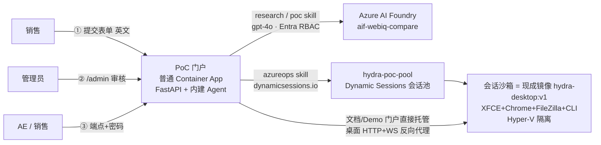

# AI PoC 自动化门户 — 方案设计(基于 Azure Container Apps Dynamic Sessions)

> 给销售团队的"一键 PoC"入口:填一张表(英文)→ 管理员审核 → AI Agent 自动完成客户/行业调研、
> 方案与 PoC 设计、Demo 站点(产出全英文),并拉起一个 **ACA dynamic sessions** XFCE 桌面沙箱(替代 VM),
> 最后把访问端点 + 密码交回销售,AE 远程连接查看。

---

## 1. 总体架构(简化版)



**关键设计(简化后)**

| 组件 | 承载 | 说明 |
|---|---|---|
| 门户 + Agent | 普通 Container App `hydra-poc-portal`(镜像 v3) | 表单/审核/状态页/文档托管/桌面代理;Agent 以 3 个 skill 内建 |
| PoC 沙箱 | Dynamic sessions 池 `hydra-poc-pool` | 桌面镜像 **`hydra-desktop:v4`**(= v1 + ffmpeg/ImageMagick/sox 预装 + 令牌鉴权的 `/agent` exec/upload 服务);每个 PoC 一个隔离会话,替代 VM |
| PoC 文档/Demo | 门户容器 `/app/data/{poc-id}/` | **门户自己托管**(在线渲染 + Demo Site),不再往沙箱里塞文件 |
| 模型 | AI Foundry `gpt-4o` | 托管身份 RBAC 认证,零密钥 |
| 语言 | 提交页 + 全部产物 **英文** | 面向外企/跨国团队可直接转发 |

## 2. Agent 三个 Skill

1. **research skill** — 客户调研报告、行业调研报告(中国市场视角、合规要求、销售谈资)
2. **poc skill** — 解决方案建议书(含 mermaid 架构图、"dynamic sessions 替代 VM"对比表)、
   PoC 实施方案(az 命令均标注 **[需用户授权后执行]**)、单文件交互式 **Demo Site**
3. **azureops skill** — 用门户**托管身份**(Session Executor RBAC)调用 dynamic sessions
   数据面:按 PoC 编号首访自动分配会话,并轮询等待桌面就绪(冷启动 30~90 秒)。
   开通其他 Azure 服务不自动执行——命令写进 PoC 方案,人工授权后再跑(human-in-the-loop)。
4. **knowledge skill(经验沉淀)** — 任务**成功后**自动收割:内建 skill + LLM 从
   方案书/PoC 计划提取用到的 Azure 服务与工具,按类别(AI & Models / Azure Services /
   Data & Analytics / Security & Compliance / Dev & Ops Tools / Sandbox Tools)
   去重合并进知识库,每条含"适用场景"描述与来源任务链接,展示在审核台下方
   📚 Knowledge Base 板块——PoC 做得越多,团队打法沉淀越厚。
5. **media / tooling skill(沙箱内工具 + 上传处理)** — 沙箱镜像预装 ffmpeg/ImageMagick/sox,
   并跑一个**令牌鉴权的 `/agent` 服务**(s6 常驻,root)。agent 可在沙箱里执行任意命令、
   `apt-get install` 装软件、上传文件。
   - 第 7 步:生成品牌媒体 + 复制文档包到桌面(`PoC-Outputs/`、`PoC-Package/`)。
   - 第 8 步(仅当提交了附件):把 `/ui` 上传的图片/视频/音频推进沙箱 `Desktop/Uploads/`,
     再由 **LLM 按场景现写一段 bash**(自动 `apt-get install` 所需工具)处理媒体,产物落
     `Desktop/Processed/`,记录进 `07-uploads-processing.md`。已实测:上传 PNG → agent 自动
     装 `webp`,产出缩略图 + 灰度图 + WebP + 拼版联系表。
   requester 远程连桌面即可查阅 `Uploads/`(原件)与 `Processed/`(产物)。
   审核台还带一个 **Sandbox console**,可对任一 ready 的 PoC 沙箱直接跑命令。

产出五件套(英文):`01-customer-research.md`、`02-industry-research.md`、
`03-solution-proposal.md`、`04-poc-plan.md`、`05-demo-site.html`,全部存门户 `/app/data/{poc-id}/`。

## 3. 流程与授权门

```
销售提交(英文表单) → pending_approval(不消耗资源)
   ↓ 管理员在 /admin?token=… 审核【授权门①】(failed 可一键重试)
六步流水线: Customer research → Industry research → Solution proposal
            → PoC plan → Demo site → Sandbox desktop ready
   ↓
ready: 状态页给出 AE 端点 /poc/{id} + 访问密码
   ↓ AE 凭密码进入【授权门②】
在线文档查看(门户托管) / Demo Site / XFCE 远程桌面(HTTP+WS 代理到 dynamic session)
额外 Azure 服务开通 → 按 PoC 方案中标注的命令人工执行【授权门③】
```

## 4. 为什么用 Dynamic Sessions 替代 VM

| | Dynamic Sessions | 传统 VM |
|---|---|---|
| 拉起 | 池中预热,秒级 | 分钟级 |
| 隔离 | 每 PoC 一个 Hyper-V 沙箱 | 需自行规划 |
| 运维 | 无补丁/无守护 | 打补丁、装 agent |
| 计费 | 活跃才计费,闲置自动销毁 | 常开常付 |
| 回收 | cooldown 自动;资料门户托管可秒级恢复 | 手动 |

## 5. 已部署资源清单(East Asia · rg-hydra-sandbox)

| 资源 | 值 |
|---|---|
| 销售入口 | https://hydra-poc-portal.blackdune-26fddb13.eastasia.azurecontainerapps.io/ui |
| 审核台 | 同域 `/admin?token=<ADMIN_TOKEN>`(token 在 session files) |
| 会话池 | `hydra-poc-pool`(镜像 **hydra-desktop:v2**,targetPort 3000,cooldown 3600s,egress 开) |
| 池端点 | https://hydra-poc-pool.blackdune-26fddb13.eastasia.azurecontainerapps.io |
| 门户镜像 | ACR `hydrasandboxacr` / `hydra-poc-portal:v5` |
| RBAC | 门户 MI:池上 *Session Executor*;AOAI 上 *Cognitive Services OpenAI User* |

## 6. 安全与合规要点

- 全链路无密钥:AOAI 与会话池均走 Entra 托管身份(密钥被禁用也能用)
- 沙箱数据面必须带 Entra token,AE 不直连池;门户以密码门 + Cookie 做代理转发
- 审核前不消耗任何 AOAI/沙箱资源;demo 页明确标注"模拟数据"
- 生产化建议:门户前加 Entra ID 登录(Easy Auth)、状态存 Azure Files/PG、
  demo/文档增加 DLP 审查、审批接入 Teams Approval

## 7. 成本控制

- 沙箱:cooldown 3600s 自动销毁;资料由门户托管,再次访问自动恢复(约 1 分钟)
- 池 ready=1 保一个热会话,演示不冷启;不用时 `az containerapp sessionpool update --ready-sessions 0`
- 门户:1 vCPU/2Gi 单副本

## 8. 演示脚本(给同事,5 分钟)

1. 打开销售入口 `/ui`,填(英文):Fosun Pharma / Pharmaceuticals & Healthcare / 场景(见案例)→ Submit
2. 打开审核台 `/admin?token=…` → 点"✅ Approve"(讲:审核门,资源消耗前置把关)
3. 状态页实时看六步流水线(讲:research / poc / azureops 三个 skill 的分工)
4. ready 后复制端点+密码 → 新窗口打开 → 输密码
5. 依次展示:英文文档在线渲染 → 🌐 Demo Site(交互仪表盘)→ 🖥️ Remote Desktop
   (XFCE 桌面 Chrome/FileZilla 可用,讲:这是 dynamic session 秒级拉起的沙箱,不是 VM)

## 9. 踩坑记录(webtop/linuxserver.io 镜像三大坑,简化方案的由来)

1. **别在 webtop 里加自己的 nginx**:其 init 守护会主动 SIGKILL 镜像内"外来" nginx
   ("Zombie nginx processes still active"),前置代理必死。
2. **别动全局 pip 的 websockets 版本**:降到 12.x 会弄坏 webtop 自带的 selkies 流媒体
   (报 `No module named 'websockets.asyncio'`,需 ≥13),桌面直接黑掉。
3. **`CUSTOM_PORT` 环境变量残留**:sessionpool update 只改镜像不清 env,老的
   `CUSTOM_PORT=3001` 会让 webtop 监听 3001 而入口指向 3000 → 永久 502。
   换镜像时务必 `--env-vars CUSTOM_PORT=3000 …` 一并重设,且**换新 identifier** 测试
   (旧会话还是旧镜像)。
4. **dynamic sessions 里 lsio 运行时生成的 nginx 配置会失效**:同一镜像在普通
   Container App 正常(root + 持久运行),在会话池里 nginx 反复以
   `no "ssl_certificate" is defined` 崩溃(桌面栈 X/selkies 却都活着)。
   修法 = 构建期把**解析好的 HTTP-only 站点配置和自签证书直接烧进镜像**
   (`hydra-desktop:v2`),不依赖运行时 init 写 /etc/nginx。修好后一次探测即 200,
   WebSocket 握手经池返回 101。
5. **webtop 的 nginx 真正生效的配置不在 sites-enabled**:想给沙箱加自定义
   `location /agent/`(exec 服务反代)时,改 `/defaults/default.conf` 或
   `sites-enabled/default` 都不生效——`/agent/` 一直 404 而 `/` 桌面正常。原因是该
   webtop 变体的 nginx 实际从别处(http.d/conf.d)加载 server。修法 = cont-init 脚本
   **遍历所有候选配置文件、往真正监听 3000 的那个里注入 `/agent/`,再 `nginx -T` 落日志
   自证**(见 sbx-image/90-nginx-fix.sh)。exec 服务本身用纯 stdlib http.server + s6 常驻,
   不碰 selkies 的 websockets 依赖。

→ 结论:沙箱基于现成 `hydra-desktop:v1` 加一层**很薄的会话兼容 + 工具补丁**(v4),
   桌面栈零改动;PoC 文档由门户托管、工具产物落桌面——这就是最终方案。

## 10. 已知限制

- 门户 `/app/data` 是容器临时盘,**每次镜像更新/新 revision 会清空**(记录+文档);
  生产化需挂 Azure Files。
- 桌面 WebSocket 经"门户→池"双层代理属于非常规用法;文档/Demo 为纯 HTTP 已验证可靠,
  桌面若卡可直连池数据面(带 Entra token)。

## 11. 复星医药案例(poc-b1fae6,英文产出,已跑通)

- 输入:customer=**Fosun Pharma**,industry=**Pharmaceuticals & Healthcare**,
  scenario=*Design and validate an AI agent that uses generative AI to automate the analysis of
  clinical trial data and real-world data (RWD) and to generate first-draft research reports.*
- 产物(英文):Customer Research / Industry Research / Solution Proposal / PoC Plan / Demo Site
- 验证:文档渲染 200、Demo Site 200、远程桌面经门户代理 200、WS 握手 101
- 访问:`/poc/poc-b1fae6` + 密码(见 session files/fosun-poc-en.txt;状态页也会显示)
- 第二案例(用户提交):好未来 / 教育 / 员工出差申请管理 agent → `poc-7e82ab`
- 两案例完成后,审核台知识库自动沉淀 20 条 skill/tool(7 类,含适用场景与来源链接)
