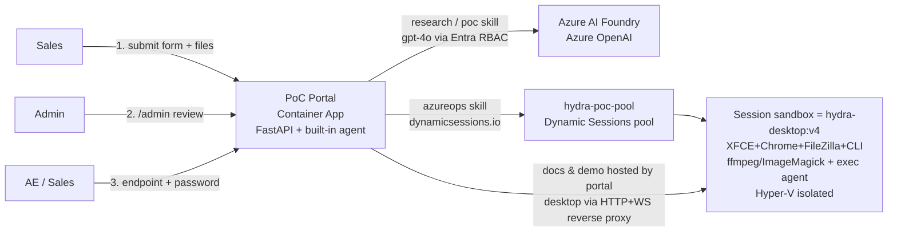

# AI PoC Automation Portal — Design (on Azure Container Apps Dynamic Sessions)

> A "one-click PoC" entry point for the sales team: fill in one form (with optional
> file uploads) → admin approval → an AI agent completes customer/industry research,
> solution & PoC design and a demo site (all outputs in English), allocates an
> **ACA dynamic sessions** XFCE desktop sandbox (replacing VMs), runs tools inside
> it, and hands the access endpoint + password back to sales for the AE to review
> remotely.

---

## 1. Architecture



**Key design decisions**

| Component | Runs on | Notes |
|---|---|---|
| Portal + agent | Container App `hydra-poc-portal` (image v7) | Form / approval / status pages / doc hosting / desktop proxy; agent implemented as in-process skills |
| PoC sandbox | Dynamic sessions pool `hydra-poc-pool` | Desktop image **`hydra-desktop:v4`** (= v1 base + ffmpeg/ImageMagick/sox pre-baked + token-gated `/agent` exec/upload service); one isolated session per PoC, replacing a VM |
| PoC docs / demo | Portal container `/app/data/{poc-id}/` | **Hosted by the portal itself** (online rendering + demo site); a copy is also placed on the sandbox desktop |
| Model | Azure OpenAI `gpt-4o` | Managed-identity RBAC, zero keys |
| Language | Submission page + all deliverables in **English** | Directly shareable with international teams |

## 2. Agent Skills

1. **research skill** — Customer Research Report and Industry Research Report
   (China-market view, compliance requirements, seller talking points).
2. **poc skill** — Solution Proposal (with mermaid architecture diagram and a
   "dynamic sessions vs. VM" comparison), PoC Implementation Plan (all `az`
   commands tagged **[REQUIRES USER AUTHORIZATION]**), and a single-file
   interactive **Demo Site**.
3. **azureops skill** — Calls the dynamic-sessions **data plane** with the
   portal's managed identity (Session Executor RBAC): first request with a new
   `identifier` allocates the session; polls until the desktop serves HTTP 200
   (cold start 30–90 s). Provisioning of additional Azure services is
   intentionally manual — commands live in the PoC plan and run only after
   human authorization (human-in-the-loop).
4. **knowledge skill (experience distillation)** — After a task **succeeds**,
   automatically harvests: built-in skills + Azure services/tools the LLM
   extracts from the proposal/PoC plan, deduplicated into a knowledge base by
   category (Agent Skills / AI & Models / Azure Services / Data & Analytics /
   Security & Compliance / Dev & Ops Tools / Sandbox Tools). Each entry carries
   a "when to use" description and links back to the source PoCs; rendered as
   the 📚 Knowledge Base section on the approval console. The more PoCs run,
   the richer the team playbook.
5. **media / tooling skill (in-sandbox tools + upload processing)** — The
   sandbox image pre-bakes ffmpeg/ImageMagick/sox and runs a **token-gated
   `/agent` service** (s6-supervised, root). The agent can execute arbitrary
   commands, `apt-get install` software, and upload files.
   - Step 7: generates branded media and copies the document pack onto the
     desktop (`PoC-Outputs/`, `PoC-Package/`).
   - Step 8 (only when attachments were submitted): pushes files uploaded at
     `/ui` into the sandbox `Desktop/Uploads/`, then the **LLM writes a bash
     script on the fly** (auto `apt-get install`s whatever it needs) to process
     the media; results land in `Desktop/Processed/` and are documented in
     `07-uploads-processing.md`. Verified live: an uploaded PNG → the agent
     installed `webp` on demand and produced a thumbnail + grayscale + WebP +
     contact-sheet montage.
   The requester reviews `Uploads/` (originals) and `Processed/` (outputs) on
   the remote desktop. The approval console also has a **Sandbox console** to
   run commands in any ready PoC's sandbox.

Deliverables (English): `01-customer-research.md`, `02-industry-research.md`,
`03-solution-proposal.md`, `04-poc-plan.md`, `05-demo-site.html`,
`06-sandbox-tools.md` (+ `07-uploads-processing.md` when files were uploaded),
all stored under the portal's `/app/data/{poc-id}/`.

## 3. Flow & Authorization Gates

```
Sales submit (form + optional files) → pending_approval (no resources consumed)
   ↓ Admin reviews at /admin?token=…  [GATE 1]  (failed tasks get a one-click Retry)
Pipeline: Customer research → Industry research → Solution proposal
          → PoC plan → Demo site → Sandbox desktop ready
          → In-sandbox tooling → (Uploads processing)
   ↓
ready: status page shows the AE endpoint /poc/{id} + access password
   ↓ AE enters with the password  [GATE 2]
Online doc viewer (portal-hosted) / Demo Site / XFCE remote desktop
(HTTP+WS proxied to the dynamic session)
Extra Azure services → run the tagged commands manually  [GATE 3]
```

## 4. Why Dynamic Sessions instead of VMs

| | Dynamic Sessions | Traditional VM |
|---|---|---|
| Startup | Pre-warmed pool, seconds | Minutes |
| Isolation | Hyper-V sandbox per PoC | Plan it yourself |
| Ops | No patching / no daemons | Patching, agents |
| Billing | Pay while active; auto-destroyed when idle | Always-on cost |
| Recycling | Automatic after cooldown; docs stay portal-hosted and restore in seconds | Manual |

## 5. Deployed Resources (East Asia · rg-hydra-sandbox)

| Resource | Value |
|---|---|
| Sales entry | https://hydra-poc-portal.blackdune-26fddb13.eastasia.azurecontainerapps.io/ui |
| Approval console | same host, `/admin?token=<ADMIN_TOKEN>` |
| Session pool | `hydra-poc-pool` (image **hydra-desktop:v4**, targetPort 3000, cooldown 3600 s, egress enabled) |
| Pool endpoint | https://hydra-poc-pool.blackdune-26fddb13.eastasia.azurecontainerapps.io |
| Portal image | ACR `hydrasandboxacr` / `hydra-poc-portal:v7` |
| RBAC | Portal MI: *Session Executor* on the pool; *Cognitive Services OpenAI User* on AOAI |

## 6. Security & Compliance

- Keyless end to end: AOAI and the session pool both use Entra managed identity
  (works even when account keys are disabled by policy).
- The sandbox data plane always requires an Entra token; AEs never reach the
  pool directly — the portal fronts it with a password gate + cookie proxy.
- The in-sandbox `/agent` exec service additionally requires the `EXEC_TOKEN`
  shared secret (set on both the pool and the portal), and is excluded from the
  AE-facing proxy.
- Nothing is consumed before approval; demo pages are clearly labeled
  "simulated data".
- Production hardening: put Entra ID login (Easy Auth) in front of the portal,
  persist state to Azure Files/PostgreSQL, add DLP review for docs/demos, wire
  approvals into Teams Approvals.

## 7. Cost Control

- Sandboxes auto-destroy after the 3600 s cooldown; docs are portal-hosted, so
  revisiting a PoC restores a fresh desktop in ~1 minute.
- Keep `ready-sessions 1` for instant demos; set
  `az containerapp sessionpool update --ready-sessions 0` when idle.
- Portal: single replica, 1 vCPU / 2 Gi.

## 8. Demo Script (5 minutes, for colleagues)

1. Open the sales entry `/ui`; fill in: Fosun Pharma / Pharmaceuticals &
   Healthcare / the scenario (see the case below); optionally attach an image →
   Submit.
2. Open the approval console `/admin?token=…` → click "✅ Approve" (talking
   point: approval gate — resources are only consumed after review).
3. Watch the pipeline on the status page (talking point: the division of labor
   across the research / poc / azureops / media skills).
4. When ready, copy the endpoint + password → open in a new window → enter the
   password.
5. Show in order: English docs rendered online → 🌐 Demo Site (interactive
   dashboard) → 🖥️ Remote Desktop (XFCE with Chrome/FileZilla; the desktop
   folders `PoC-Package/`, `PoC-Outputs/`, `Uploads/`, `Processed/` — talking
   point: this is a dynamic session spun up in seconds, not a VM).

## 9. Pitfalls (webtop / linuxserver.io images × dynamic sessions)

1. **Don't add your own nginx inside webtop**: its init supervisor SIGKILLs
   "foreign" nginx processes ("Zombie nginx processes still active"), so a
   front proxy inside the image always dies.
2. **Don't downgrade the global pip `websockets`**: pinning 12.x breaks
   webtop's bundled selkies streaming stack (`No module named
   'websockets.asyncio'`, needs ≥13) and the desktop goes black. (The portal
   pins websockets==12.0 in its *own* container only — that's intentional.)
3. **`CUSTOM_PORT` env residue on the pool**: `sessionpool update` with only
   `--image` keeps old env vars; a leftover `CUSTOM_PORT=3001` makes webtop
   listen on 3001 while ingress targets 3000 → permanent 502. Always re-set
   `--env-vars CUSTOM_PORT=3000 …` when changing images, and test with a **new
   identifier** (old sessions keep the old image).
4. **lsio's runtime-generated nginx config breaks under dynamic sessions**: the
   same image works as a normal Container App but crash-loops in the pool with
   `no "ssl_certificate" is defined` (while X/selkies stay alive). Fix: bake a
   resolved HTTP-only site config + self-signed cert into the image at build
   time (`hydra-desktop:v2`) instead of relying on runtime init writing
   /etc/nginx. After the fix the first probe returns 200 and the WebSocket
   handshake through the pool returns 101.
5. **webtop's live nginx config is not `sites-enabled`**: adding a custom
   `location /agent/` by editing `/defaults/default.conf` or
   `sites-enabled/default` silently does nothing (`/agent/` 404s while `/`
   works) because this webtop variant loads its server block from another path
   (http.d/conf.d). Fix: a cont-init script **iterates all candidate config
   files, injects `/agent/` into whichever one actually listens on 3000, then
   logs `nginx -T` as proof** (see `sandbox-image/90-nginx-fix.sh`). The exec
   service itself is stdlib `http.server` under s6 — it never touches selkies'
   websockets dependency.

→ Conclusion: the sandbox is the stock `hydra-desktop:v1` plus a **thin
session-compat + tooling patch** (v4); the desktop stack is untouched; PoC docs
are portal-hosted and tool outputs land on the desktop.

## 10. Known Limitations

- The portal's `/app/data` is an ephemeral container disk — **every image
  update / new revision wipes it** (records + docs). Mount Azure Files for
  production.
- Desktop WebSocket through the double proxy (portal → pool) is an unusual
  path; docs/demo are plain HTTP and verified reliable. If the desktop lags,
  connect to the pool data plane directly (with an Entra token).

## 11. Case Study: Fosun Pharma (English deliverables, verified)

- Input: customer = **Fosun Pharma**, industry = **Pharmaceuticals &
  Healthcare**, scenario = *Design and validate an AI agent that uses
  generative AI to automate the analysis of clinical trial data and real-world
  data (RWD) and to generate first-draft research reports.*
- Deliverables (English): Customer Research / Industry Research / Solution
  Proposal / PoC Plan / Demo Site / Sandbox Tools report.
- Verified: doc rendering 200, demo site 200, remote desktop through the portal
  proxy 200, WebSocket handshake 101, ffmpeg/ImageMagick artifacts on the
  desktop.
- Additional cases: TAL Education (travel-request agent) and an upload-processing
  case where the agent installed `webp` at runtime and produced thumbnail /
  grayscale / WebP / contact-sheet outputs from an uploaded PNG.
- After successful runs the approval console's Knowledge Base auto-distills
  20+ skills/tools across 7 categories with usage scenarios and source links.
